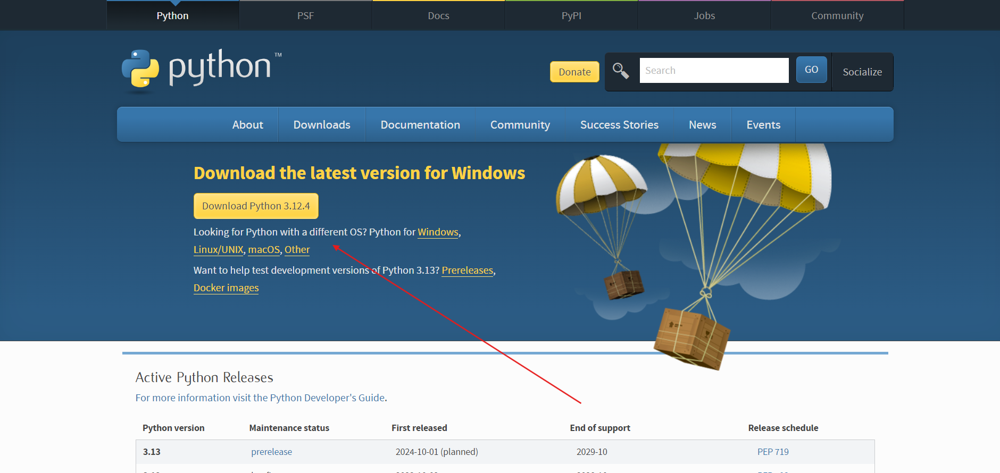
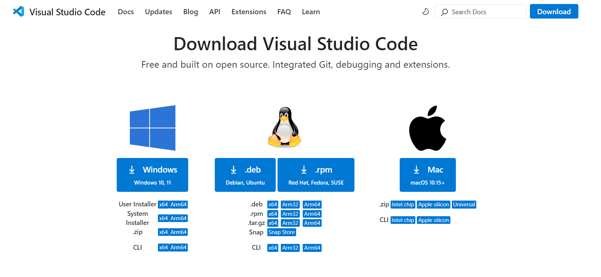
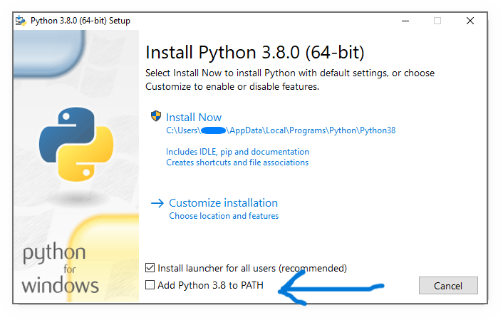
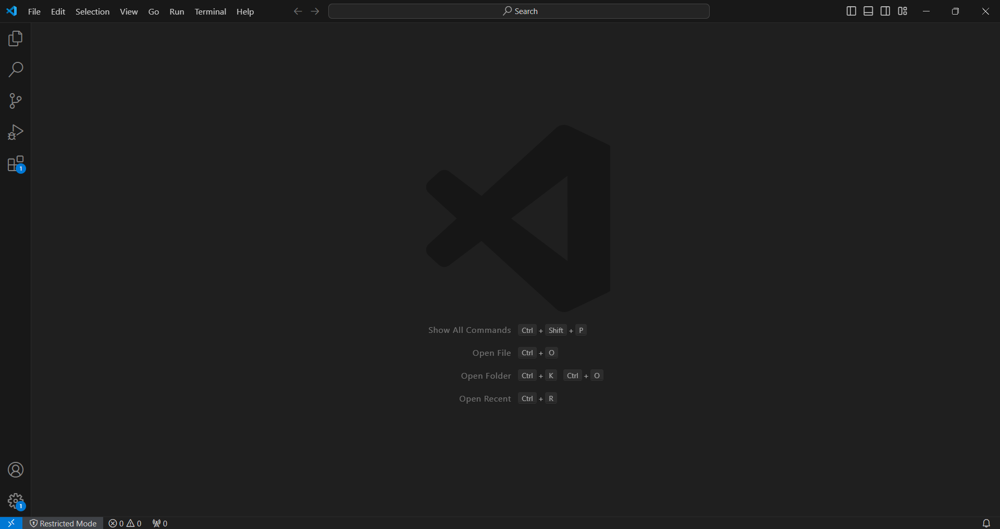
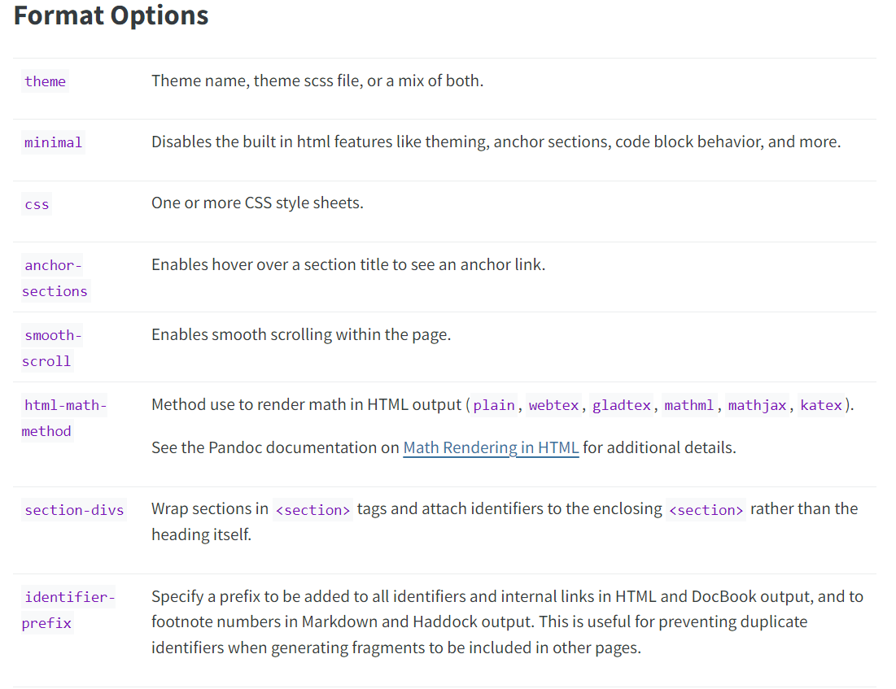

# Quarto.org 🤝 GITHUB
Arthur Ramos Pereira

# Contexto

Usar o Quarto e o GitHub como ferramentas para postar o material criado
gerando um marketing pessoal.

## O que é Quarto

Quarto é uma ferramenta open source que foi desenvolvida para ser um
sistema de publicação científica e técnica.<br> Com esta ferramenta é
possível criar publicações de artigos, apresentações, sites, blogs,
livros com HTML, PDF, GFM (GitHub Flavored Markdown), MS Word e etc.

## Como baixar e utilizar

+ Acesse [Quarto.org](https://quarto.org/docs/get-started/) para fazer o
download do Quarto <br> Clique na versão compatível com o seu sistema
operacional <br>


Para utilizar o Quarto será necessário ter uma das
seguintes ferramentas instaladas: VS Code, Jupyter, RStudio, Neovim,
Text Editor <br>

Neste tutorial usaremos o VSCode <br>

O Quarto permite linguagens de programação embarcadas como: Python, R,
Julia, LaTeX, etc. <br>

+ Acesse [Python.org](https://www.python.org/downloads/) para fazer
download do Python caso não tenha <br>


+ Acesse [VSCode](https://code.visualstudio.com/download) para fazer
download do VSCode caso não tenha <br>


+ Após fazer os downloads será necessário instalar os programas, para o VSCode e Quarto dê dois cliques e aperte a opção de next ou próximo, nenhuma configuração especial será necessária
+ Para o Python abra o instalador e quando aparecer a tela abaixo assinale a opção ADD Python to Path


+ Abra o VSCode

+  use o atalho Ctrl + Shift + X para acessar as extensões
pesquise Quarto e clique em install <br> Acesse o terminal clicando ou
usando o atalho Ctrl + Shift + ’ <br> <br>  <br>

+ No terminal
utilize o comando: <br>

    py -m pip install jupyter matplotlib plotly

Para criar o arquivo vá no canto superior esquerdo, clique em file, new
file, clique em Quarto Document.

## Estrutura básica

O arquivo gerado pelo quarto é do tipo .qmd <br> No código abaixo é
possível ver como se inicia. <br> Dentro dos três travessões inserimos o
título, o formato que utilizaremos (HTML, MS Word, PDF gfm etc.), o
autor e algumas configurações que serão vistas posteriormente.

    ---
    title: "Untitled"
    format: html
    author: 
    ---

Para apresentarmos um código usamos três acentos agudos no começo e três
acentos agudos no final

``` {quarto}
```

Insira o código aqui

Para rodarmos uma das linguagens embarcadas na estrutura colocamos em
chaves o nome da linguagem acento agudo no final

        ```{nome_da_linguagem}
        Insira o código aqui
        ```

Para gerar uma preview do código utilize o comando Ctrl + Shift + k \##
Computations Usando como exemplo a linguagem de programção python

<details class="code-fold">
<summary>Code</summary>

``` python
import numpy as np
a = np.arange(0,15)
a
```

</details>

    array([ 0,  1,  2,  3,  4,  5,  6,  7,  8,  9, 10, 11, 12, 13, 14])

## Figuras

Para colocar uma figura é necessário que a imagem esteja na pasta do
arquivo. Para encontrar a pasta do arquivo vá em File depois clique em
Open Workspace from File. <br> Coloque a figura usando a seguinte
estrutura:

    [nome da figura](nome_da_figura.png){#fig-nome_de_referência}

Exemplo

        ```
        [Logo do EAIlab](EAIlab.png){#fig-EAI}
        ```


Este código irá gerar a
<a href="#fig-EAI" class="quarto-xref">Figure 1</a>, as chaves indicam
que está figura será referenciada, para usá-la no texto coloque @ antes
do nome_de_referência dessa forma todas as imagens serão numeradas
automaticamente e ficará mais fácil para o leitor navegar pelo
documento.

## Citações

Para fazer citações automáticas será necessários ter um arquivo do tipo
BibLaTeX (.bib) ou BibTeX (.bibtex) e na estrutura básica acrescentar:


    ---
    bibliography: nome_do_arquivo.bib

    ---

<br> Ferramentas como Google Scholar criam automaticamente a estrutura
do arquivo do tipo .bib, ao clicar em citar em algum texto do Google
Scholar aparece a opção no canto inferior Bibtex <br>

<div>

</div>

<br> Em destaque na segunda imagem está a forma como deve ser
referenciado no quarto para chamar aquela citação, usaremos o @ + o nome
de referência para colocarmos no texto para este exemplo: <br>

    Veja em @varella2024integrated

Gerando o seguinte trecho: Veja em Varella et al. (2024) <br> No mesmo
arquivo do tipo .bib é possívle inserir outras citações como por exemplo
ao colocar o seguinte trecho dentro do arquivo do tipo .bib:

    @article{arnaldo2024,
       author = {Arnaldo de Carvalho Junior and João Francisco Justo and Alexandre Maniçoba de Oliveira and João Inacio da Silva Filho},
       doi = {10.1016/j.engappai.2023.107342},
       issn = {09521976},
       journal = {Engineering Applications of Artificial Intelligence},
       month = {1},
       pages = {107342},
       title = {A comprehensive review on paraconsistent annotated evidential logic: Algorithms, Applications, and Perspectives},
       volume = {127},
       year = {2024},
    }

    Inserindo o texto:
    Veja em @arnaldo2024

<br>

Veja em Carvalho Junior et al. (2024)

Para criar os tópico de referências no final do texto pode ser usar a
seguinte estrutura:

    ### Referências

    ::: {#refs}
    :::

## Variedade de textos possíveis com a ferramenta

Uma das grandes vantagens do Quarto é que dominando essa ferramenta é
possível criar de forma fácil diversos tipos de textos de diversos
formatos e com boa qualidade.

Para mudarmos o formato devemos alterar na estrutura básica o format:
<br> `format: formato_desejado` <br> Dentre os formato possíveis tem:
pdf, html, docx, typst e gfm. Em cada um é possível alterar as
configurações dentro da estrutura básica como por exemplo em html
algumas configurações estão listadas na imagem abaixo. [Para mais
informações.](https://quarto.org/docs/authoring/footnotes-and-citations.html#sec-citations)
<br> 

## Books

Além de simples páginas a ferramenta também permite estruturas como
livros, blogs e websites. Neste tutorial daremos foco para criação de
livros. <br> No VSCODE usando o atalho Ctrl + Shift + P digataremos
Quarto e escolheremos Create Project, selecione a opção Book Project
<br> O livro terá essa estrutura

    project:
      type: book

    book:
      title: "uth_book"
      author: "Norah Jones"
      date: "04/04/2024"
      chapters:
        - index.qmd
        - intro.qmd
        - summary.qmd
        - references.qmd

    bibliography: references.bib

    format:
      html:
        theme: cosmo
      pdf:
        documentclass: scrreprt

<br>

Note que em após chapter: tempos o capítulos do livro que são arquivos
do tipo .qmd, esses arquivos ficam na aba do explorer (à esquerda). Para
vermos o livro digitamos no terminal, note que este comando só irá
funcionar se o terminal estiver no diretorio que fora criado junto com o
livro:

    quarto render

## Criando quarto pub

Após criar o livro use o comando no terminal ´´´ quarto publish
quarto-pub ´´´ Para publicar o conteúdo no quartopub, uma maneira rápida
e fácil de criar uma publicação PÚBLICA usando o Quarto. No próximo
tópico iremos explorar como usar essa ferramenta para publicar no
GitHub.

## GitHub

### References

<div id="refs" class="references csl-bib-body hanging-indent"
entry-spacing="0">

<div id="ref-arnaldo2024" class="csl-entry">

Carvalho Junior, Arnaldo de, João Francisco Justo, Alexandre Maniçoba de
Oliveira, and João Inacio da Silva Filho. 2024. “A Comprehensive Review
on Paraconsistent Annotated Evidential Logic: Algorithms, Applications,
and Perspectives.” *Engineering Applications of Artificial Intelligence*
127 (January): 107342. <https://doi.org/10.1016/j.engappai.2023.107342>.

</div>

<div id="ref-varella2024integrated" class="csl-entry">

Varella, Walter Augusto, Geraldo Cardoso de Oliveira Neto, Eduardo
Stefani, Ivanir Costa, Rogério Carlos Monteiro, Wilians Conde, Wanderley
da Silva Junior, et al. 2024. “Integrated Service Architecture to
Promote the Circular Economy in Agriculture 4.0.” *Sustainability* 16
(6): 2535.

</div>

</div>
